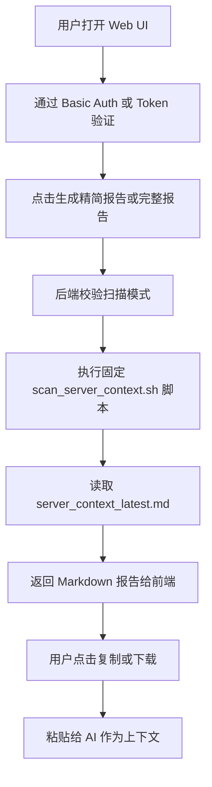

# Server Context Scanner Web UI 产品需求文档

## 1. 产品概述
Server Context Scanner Web UI 是一个跨设备可访问的服务器上下文扫描网页，用于点击按钮生成服务器状态报告并一键复制给 AI。
- 主要解决终端报告过长、手动选择复制不方便、跨设备无法触发扫描的问题。
- 目标用户是服务器维护者本人，核心价值是降低与 AI 协作时的服务器上下文采集成本。

## 2. 核心功能

### 2.1 用户角色
| 角色 | 访问方式 | 核心权限 |
|------|----------|----------|
| 服务器维护者 | Nginx Basic Auth 或访问 Token | 触发精简/完整扫描、复制报告、下载报告 |

### 2.2 功能模块
1. **扫描控制台页面**：显示扫描按钮、报告内容、复制和下载操作。
2. **后端扫描 API**：只允许触发固定脚本，不允许输入任意命令。
3. **安全访问入口**：通过 Nginx HTTPS 和 Basic Auth 保护公网访问。

### 2.3 页面详情
| 页面名称 | 模块名称 | 功能描述 |
|----------|----------|----------|
| 扫描控制台 | 顶部操作栏 | 提供“生成精简报告”“生成完整报告”“复制报告”“下载 Markdown”“清空”按钮，按钮固定在报告区域上方，减少滚动操作 |
| 扫描控制台 | 状态反馈区 | 显示空闲、扫描中、成功、失败、复制成功等状态 |
| 扫描控制台 | 报告信息区 | 显示报告模式、生成时间、字符数、行数 |
| 扫描控制台 | Markdown 报告区 | 以等宽字体展示报告内容，支持长文本滚动 |
| 扫描控制台 | 安全提示区 | 提醒该工具只执行固定只读扫描脚本，不支持任意命令 |

## 3. 核心流程
用户在任意设备打开受保护的网页，点击扫描按钮后，后端执行固定脚本并读取最新报告，前端展示报告并提供复制能力。

## 4. 用户界面设计

### 4.1 设计风格
- 主色：深墨蓝与冷灰，强调运维工具的可靠、克制和安全感。
- 辅色：绿色用于成功反馈，琥珀色用于风险提示，红色用于错误。
- 按钮：顶部工具栏按钮，圆角矩形，高对比状态反馈，复制成功后变绿并显示“已复制”。
- 字体：界面使用清晰无衬线字体，报告区使用等宽字体。
- 布局：桌面优先，单页控制台布局，操作区固定在报告上方。

### 4.2 页面设计概览
| 页面名称 | 模块名称 | UI 元素 |
|----------|----------|---------|
| 扫描控制台 | 顶部标题 | 工具名称、当前模式、访问安全提示 |
| 扫描控制台 | 操作栏 | 精简扫描、完整扫描、复制、下载、清空按钮 |
| 扫描控制台 | 状态卡片 | 扫描状态、报告大小、生成时间 |
| 扫描控制台 | 报告区域 | Markdown 文本框、长内容滚动、复制友好 |
| 扫描控制台 | 页脚提示 | 不读取 `.env` 内容、不执行任意命令 |

### 4.3 响应式设计
桌面优先，同时适配手机和平板。
- 桌面端：操作栏横向排列，报告区域占主要空间。
- 移动端：按钮自动换行，报告区域保持可滚动，复制按钮始终在报告上方。
- 长文本操作优先：复制、下载、清空按钮必须位于输入/输出区域顶部。
