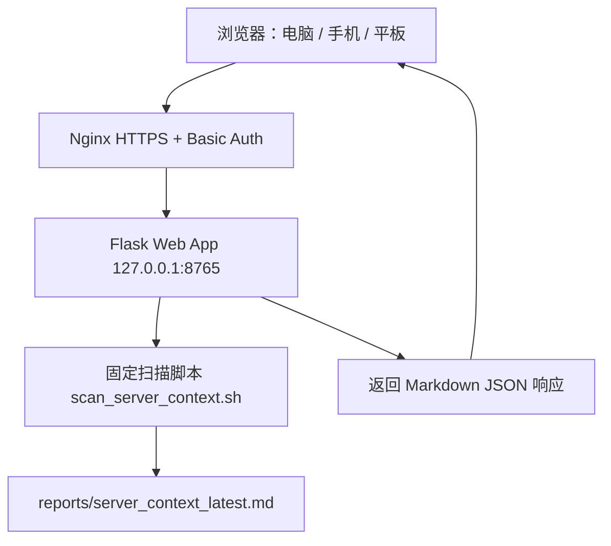
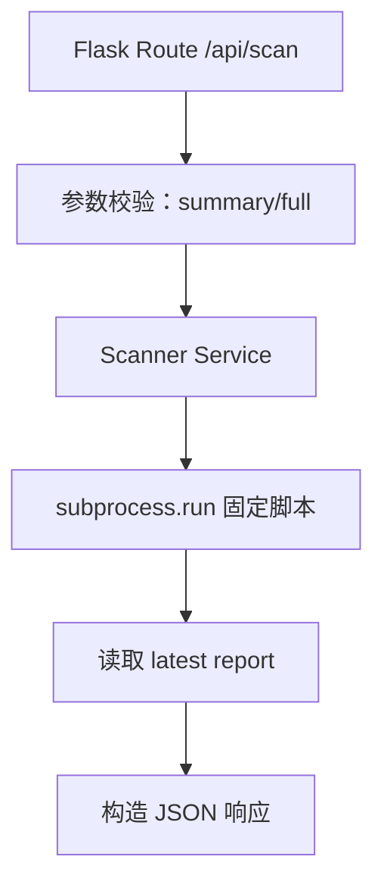

# Server Context Scanner Web UI 技术架构文档

## 1. 架构设计
Web UI 采用轻量后端架构：浏览器访问受保护的 Nginx HTTPS 域名，Nginx 反向代理到仅监听 `127.0.0.1` 的 Flask 服务，Flask 只允许执行固定扫描脚本并返回 Markdown 报告。



## 2. 技术说明
- 前端：原生 HTML + CSS + JavaScript，避免引入复杂构建链。
- 后端：Python 3 + Flask。
- 进程管理：优先使用 PM2 或 systemd，第一版提供 PM2 示例。
- 反向代理：Nginx，将公网 HTTPS 域名代理到 `127.0.0.1:8765`。
- 访问保护：第一版推荐 Nginx Basic Auth；可选增加 Flask Token 校验。
- 数据存储：不使用数据库，只读取 `reports/server_context_latest.md`。

## 3. 路由定义
| 路由 | 用途 |
|------|------|
| `/` | Web UI 主页面 |
| `/api/scan` | POST，触发精简或完整扫描 |
| `/api/latest` | GET，读取最新报告 |
| `/download/latest` | GET，下载最新 Markdown 报告 |
| `/healthz` | GET，健康检查 |

## 4. API 定义

### 4.1 触发扫描
```typescript
type ScanRequest = {
  mode: "summary" | "full";
};

type ScanResponse = {
  ok: boolean;
  mode: "summary" | "full";
  report: string;
  reportPath: string;
  generatedAt: string;
  lineCount: number;
  charCount: number;
  error?: string;
};
```

约束：
- `mode` 只允许 `summary` 或 `full`。
- `summary` 对应执行 `./scan_server_context.sh`。
- `full` 对应执行 `./scan_server_context.sh --full`。
- 不允许前端传入任意命令。
- 后端执行命令需设置超时，避免扫描卡死。

### 4.2 读取最新报告
```typescript
type LatestReportResponse = {
  ok: boolean;
  report: string;
  reportPath: string;
  lineCount: number;
  charCount: number;
  error?: string;
};
```

## 5. 服务端架构图


## 6. 安全策略
- Flask 服务默认只绑定 `127.0.0.1`，不直接暴露公网。
- 公网访问必须经过 Nginx HTTPS。
- 默认建议启用 Nginx Basic Auth。
- 后端不提供命令输入接口。
- 后端只执行仓库内固定脚本。
- 扫描脚本继续保持只读，不读取 `.env` 内容。
- API 超时时间默认 120 秒。
- 前端不展示任何 shell 命令输入框。

## 7. 部署规划
推荐目录继续使用：

```text
~/server-context-scanner
```

新增文件：

```text
web_app.py
web/
├── templates/
│   └── index.html
└── static/
    ├── app.js
    └── style.css
```

推荐内部端口：

```text
127.0.0.1:8765
```

推荐公网入口示例：

```text
https://scanner.bamamei.online
```
